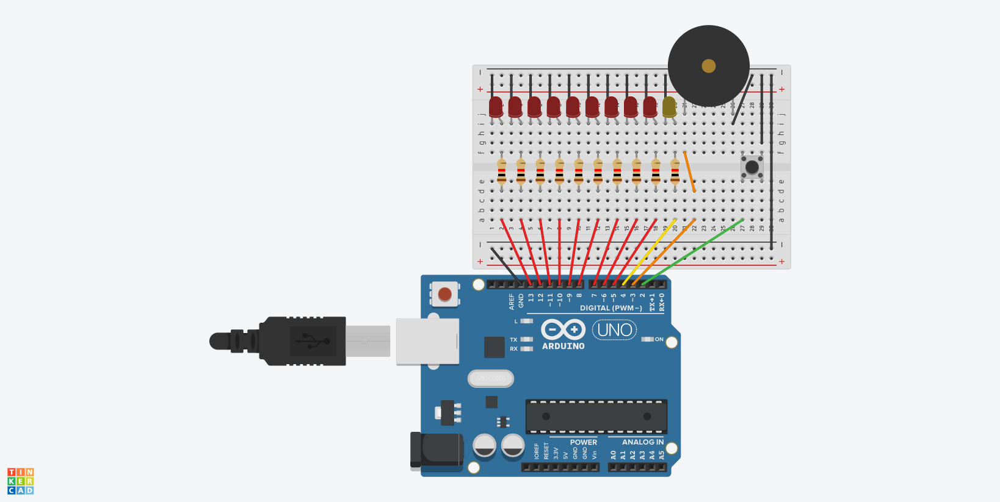

# btn-led-timer

## Use

1. The **NUMBER OF SECONDS** has to be proportional to the **NUMBER OF LEDS** (e.g. 180'' for 9 LEDs, `180 / 9 = 20`)
2. You can edit the **TIMER** `L9` 

3. The yellow LED means the **state of the timer**:
- **ON**: not running
- **OFF**: running

4. You can disable the buzzer to set `bool isBuzzer` to *false* `L17`

5. Click a *1st* time to **set** the timer
6. Click a *2nd* time to **start** the timer

## Components Quantity

Name | Quantity | Component
---- | -------- | ---------
U1 | 1 | Arduino Uno R3
D1 - D9 | 9 | Red LED
R1 - R11 | 10 | 1 kΩ Resistor
D10 | 1 | Yellow LED
S1 | 1 |  Pushbutton
PIEZO1 | 1 |  Piezo
JW1 - JW | 26 - 27 | Jumper Wires

## Circuit Diagram

